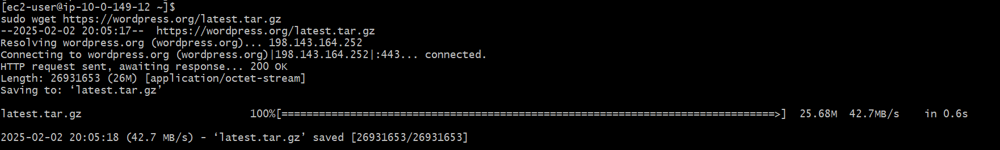

# Objective 

The project objective is to scale up a WordPress-based website using AWS services to enhances its Networking, Compute, Object storage and Database facilities

## Virtual Private Network (VPC) Architecture 

A VPC (`wordpress-VPC`) was configured with an IPv4 address range of 10.0.0.0/16. It includes two public subnets with IP ranges of 10.0.0.0/20 and 10.0.16.0/20, and two private subnets with IP ranges of 10.0.144.0/20 and 10.0.128.0/20.

The VPC spans two availability zones (us-east-1a and us-east-1b), with one public subnet and one private subnet in each availability zone.

*Public and Private subnet in 2 availabilty zones*

Using 2 availabilty zones (AZ) for configuration offers several key benefits. It enhances reliabilty for applications in cases whereby if one AZ experiences an outage, the other AZ can continue to operate, minimizing downtime and promoting fault tolerance.

In other for the VPC network to connect to the internet, it needs an internet gateway. 

However, internet gateways do not work on their own, they need **route tables** to direct traffic to the network.

2 route tables were configured to route traffic to the internet gateway (**main route table** and **public route table**). The destination of all route table is set to 0.0.0.0/0 meaning every IPv4 address can accesss this subnet.

Public and private subnets created earlier are associated with these route tables. Public subnets are associated with the "public route table" 
and are configured to target the Internet gateway. 

Private subnets are associated with **main route table** and are configured to target the NAT gateway 

 *Public route table configuration (for public subnet)*

*Main route table configuration (for private subnet)*

## NAT Gateway Architecture

Although the private subnets are now linked with the **main route table**, they still cannot connect to the internet. Unlike the public subnets that now targets the internet gateway, NAT gateways enable private subnets to connect to the internet.

*Note: When configuring NAT gateway, we need to make sure a **public subnet** is selected in which to create the NAT gateway and an elastic IP is assigned for the NAT gateway* 

A NAT gateway was successfully created, and both private subnets in different availabilty zones were attached to it. 
The route table for the private subnets (**main route table**) was updated to allow all IPv4 address / instances (denoted as 0.0.0.0/0) have access to the private the subnet. The target field is set to the newly created NAT gateway 

## Attaching VPC network to EC2 instances

2 public and 2 private instances were configured with an Amazon Linux AMI, each in different availability zones. 
One public and one private instance were set up in the **us-east-1a** region, and another public and private instance in the **us-east-1b** region.

The public instances have auto-assigned IP address enabled, and are attached to our VPC `wordpress-VPC` and public subnet, 
while the private instances do not have auto-assigned IP address enabled and is attached to the same VPC `wordpress-VPC` and private subnet. 

Note: *It’s crucial for us to operate through the private instances, as they offer a higher level of security compared to the public instances, this is where Bastion Host setup comes into play*

## Bastion Host Setup

A Bastion host is a server specifically designed to provide access to a private network from an external network. It acts as a gateway through which a user can access internal servers without exposing them directly to the outside world. It provides an additional layer of security and access control. 

Deploying of a Bastion Host is done through a series of steps  

- First we connect to our **public instance** or Bastion Host via SSH. The key file used to connect to our instance is the same for both public and private instances 'WordPress-instance.pem'.

Note: *need to make sure security groups for the public instance allows for inbound traffic via SSH*

- After successfully connecting to our Bastion Host. We need copy the private key into Our EC2 Bastion host from another terminal. We use the `cat` command to read the content of the keypair file

-  A new folder on our EC2 bastion host is created to house this private key named as `wordpress-instance-key` 

- The private keypair file was copied from the second terminal into the Bastion host instance, with the key file now renamed as `wordpress-instance-key`

- We updated file permission for `wordpress-instance-key` to only be accessible by the owner and not be publicly accessible

- SSH into private instance using our private key file and private IP.

*Note: A new security group is attached to the private instance, permitting SSH inbound traffic from the Bastion host security group. Its outbound rule allows all traffic out of the instance, which is crucial for downloading files directly via URL from the CLI terminal.*
        

# Creating AWS Relational Database 

Two mariadb relational databases - master database & standby database - were created for the wordpress website, one in each availabillity zone (us-east-1a & us-east-1b). 
The master database is configured in region us-east-1a, while the standby database is configured in region us-east-1b.

We used 2 availabilty zones to ensure the reliability of our Wordpress database in case one region goes down, this setup aligns with the principles of a well architected framework

Username `admin` and password `password123` is also setup along with the creation of the database. The password will be useful in accessing the database on the instance. 

In other to allow unrestricted flow of traffic to the database, a new security group for RDS was setup `wordpress-database-sg`, its inbound rules: MYSQL/Aurora (port range 3306) with source from the Security group of the private instance.

We disabled public access to both databases, enhancing security and minizing the risk of unauthorized users accessing the database

# AWS Elastic file system (EFS) Setup 

 An Elastic File system was created for wordpress files. The key benefit for using the EC2 is to provide a cost-effective network file system that can handle increasing workload and traffic for WordPress website. EFS Automatically grow and shrink as files capacity demand changes 

 The File system type for the EFS is regional, this allows the files to be stored in multiple availability zones, enhancing high performance  durability and reliabilty of the website. 

 for Network access, the VPC created for the wordpress website (`wordpress-VPC`) is attached to the EFS, the subnets used are private subnets with an availabilty zones `us-east-1a` and `us-east-1b`

*Note: A dedicated security group has been created for the EFS, its inbound rule allow for NFS traffic (port range 2049) with
 its source from the private instance security group.* 

# Wordpress instance configuration 

These steps provides information on how the Wordpress is configured on the private EC2 instances. 

## STEP 1: Installing Apache Webserver and PHP

Here were the steps followed to run Apache webserver on the instances

 We start by updating all the packages system that uses YUM package 

- 

-  

        installs the apache webserver 

-   

        installs mySQL community repository packages, and mySQL server package. 
        Also configures the mySQL server to start automatically when the systemm boots up.

-  

        updates all the packages on a system that uses the DNF package manager. Useful for keeping
        the system up to date with the latest security patches and software improvements. 

-  

        checks what version of PHP are available to install

-  

        installs the latest version of PHP 

**Activating the services and configure them to start automatically at system restart**

- 

        starts and enable the httpd server

- 

        starts and enable the PHP hyperlink processor

## STEP 2: Mounting the EFS on the private instance 

The EFS file system is mounted on the instance and placed specifically in the server's root folder for the website `/var/www/html`

To ensure the EFS folder is automatically mounted to the wordpress server after a restart, we inputted the following command

the following was added to the nano text editor. 

    fs-0136e8325efa12df5.efs.us-east-1.amazonaws.com:/ /var/www/html/ nfs defaults,_netdev 0 0

 we verfied that the file is successfully mounted on in the /var/www/html directory. 

## STEP 3: Downloading Wordpress 

 

        downloads the latest version of wordpress file via ur `latest.tar.gz` 

 

        extracts and decompress the archive using gzip.

 

         creates a new subdirectory `wordpress` in the apache webserver directory 

 

         copies all wordpress files and places then in the webserver directory. 

 

         changes the owner and the group for the wordpress files to apache 

## STEP 4: Connecting to RDS and creating a user-database in RDS

We connected to the master DB on the terminal using the command 

        mysql -h <RDS endpoint> -P 3306 -u admin -p 

        mysql -h wordpress-db-master.cjk8a0886zx2.us-east-1.rds.amazonaws.com -P 3306 -u admin -p

The command prompted us to enter the password for RDS. We used the same password that we had set up while creating the RDS on AWS. 

- After accessing RDS on the termial, We then create a database named 'wordpress database' as seen below
 
 

the above commands creates a database `wordpress_db` and a user for that database `admin`. It specifies that only the user `localhost` which is the EC2 machine can connect to the database.  

To verify that the database has been created, we can SHOW DATABASES; 

 

 *Note: A similar setup was done for the standby database, this time using the standby RDS endpoint. In this case the private EC2 instance is in a different availaibility zone*

 ## STEP 5: Configuring Wordpress

After creating the database for wordpress. We need to configure wordpress to be able to connect with our RDS database. 
A default file `wp-config-sample.php` has the base wordpress configuration file.

By navigating to the wordpress directory, we are able to edit the Php configuration file

We redefined the database setting to match that of our already created `wordpress-db` 

The placeholders **DB_NAME**, **DB USER**, **DB_PASSWORD** matches  RDS wordpress_db & the DB-hostname is replaced with our RDS endpoint. 

Next, we renamed the php configuration file, to **wp-config.php**. This is good practice, so as to distiguish this file from its default php configuration file. 

### Reconfiguring the root webserver directory

 There were some steps involved in other to fully configure apache webserver so that it renders our wordpress file.

First, we opened the apache configuration file using the command `sudo nano /etc/httpd/conf/httpd.conf`.
Then we require apache root webserver to point to wordpress rather that html. We adjusted the configuation of apache webserver.
The apache webserver file can be found in the httpd.conf directory

        By adding wordpress to the document root and Directory, and relaxing access, the apache webserver now renders to our wordpress directory.

we can now restart the apache webserver using the command below  

### **The above series of steps were repeated for the 2nd private instance in a different availabilty zone `us-east-1b` and connecting to the RDS standby database**

# Application Load Balancer

Before creating the load balancer, we set up a target group to route traffic to our instances.  
The target group is configured to use the HTTP protocol on port 80, with IPv4 as the IP address type. We utilized the same VPC created earlier `wordpress_db`.

After setting up the target group, we created an application load balancer and attached our target group to the load balancer. 
The application load balancer distributes incoming **HTTP** traffic across the 2 Wordpress instances in the  target group, with the listener rules configured to use HTTP protocol on port 80. 

To ensure high availabily and fault tolerance, we configured the load balancer to be used across 2 availability zones
 `us-east-1a` and `us-east-1b`, using the same public subnet and network as that of the instance `wordpress-vpc`. 

After setting up the load balancer and target group. We proceeded to register the instances in the target group. They are marked as healthy as seen below

We are able to use the DNS Name of the load balancer to access the wordpress website on our browser. 

We can proceed to install wordpress, setting up username and password.  

# Auto Scaling Group

Auto Scaling is a feature in AWS that automatically adjusts the number of EC2 instances in our application based on the demand, 
it ensures that there is a right amount of capacity to handle the load of our application. Hence promoting the cost efficiency
 by ensuring we are only running the number of instances we need at any given time and promoting fault tolerance, ensuring high availabilty in case an instance goes down. 

For the Wordpress website, we successfully setup autoscaling. The first step was to create an AMI from one of our private instance `wp-app-golden-ami`. 

**Note: Its crucial to utilize an already-configured private instance to create the AMI, as it includes the base configuration of our wordpress webserver**

## Autoscaling launch template
Next we created a launch template, and attached  the already created AMI `wp-app-golden-ami`. The instance type is `t2-micro`, and key pair used is the same as one used for the public and private eC2 instances `wordpress-instance.pem`.
 The security group for the launch template is the same as that of the security group for our private instances. No subnet / Network were seleted for the launch template at this time,
this would be done later in the step to create autoscaling group 

## Autoscaling Setup

Afterwards, we configured the autoscaling group and named it `wp-app-asg` and attached the launch template 

For Network, we used the same VPC as our instances`wordpress-VPC`. Private subnets in both availability zones `us-east-1a` & `us-east-1b` were selected, one in each region.
We integrated the previous application load balancer by attaching the target group of the balancer

We defined the group size for auto scaling, setting the desired capacity type to 2, this ensures that 
2 instances are launched with one instance in each private subnet. For Scaling the Minimum desired capacity is 2, and the maximum desired capacity 3. The number of instances would adjust based on workloads and needs of the Wordpress website. There are no scaling polices, meaning instances could terminate and launch at the same time (except in rebalancing situations). 

Auto Scaling automatically creates 2 instances, as we previously set the desired capacity. These instances use the AMI configuration of our WordPress private instances and are marked as healthy. We can now terminate the private instances as they are no longer needed.

## Showcasing Autoscaling by Simulating increased traffic

We can simulate increased traffic on Wordpress website by using tools like Apache Bench. First we SSH into one of the autoscaling instance using the same key pair `wordpress-instance.pem`. Since we are now logging into one of the created autoscaling instance, we need to specify our login as the ec2-user rather than the root user as seen below.

After succesfully logging in, Apache Bench was installed

- the next step involves simulating traffic using a shell script. Our `DNS URL`, autoscaling group name `wp-asg`, and the `desired capacity (3)` is specified in the script 

*note: we encountered an error that says invalid url, to fix this we added a `/` at the end of the DNS URL, this is because apache Bench usually requires a path to the url*

- the next step is to give the script execute permissions

-  Run the script

The console shows a new instance (wordpress-instance-03) has been automatically created as a result of autoscaling  